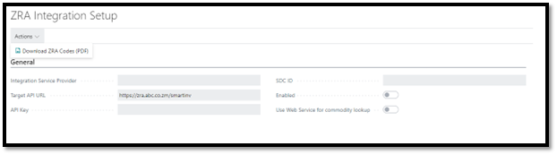

## 2. Setup and Configuration

- [Integration Setup](#integration-setup)
- [2.2 Commodity Codes](#22-commodity-codes)
- [2.3 ZRA VAT Types](#23-zra-vat-types)
- [2.4 VAT Product Posting Groups](#24-vat-product-posting-groups)
- [2.5 VAT Posting Setups](#25-vat-posting-setups)
- [2.6 Reason Codes](#26-reason-codes)
- [2.7 Payment Methods](#27-payment-methods)
- [2.8 User Management](#28-user-management)

Before using the Braintree ZRA Smart Invoice Connector, you need to set up and configure the system. This involves:

- Installing the extension in your Business Central environment
- Configuring the system settings, such as the ZRA tax code and integration setup
- Setting up user accounts and permissions

>The following system settings need to be configured.

### Integration Setup

1. Open the ZRA Integration Setup menu.
2. Select the **Integration Service Provider**
3. Confirm that the **Target API URL** is correct for the Service Provider
4. Enter the following fields 
    1. **API Key**
    2. **SDC ID**
5. Lastly, **Enable** the integration
6. If you want to host the list of commodity codes locally in the database, you can leave the **Use Web Service for commodity lookup** field disabled. Not all service providers do, but if the chosen Service Provider does support commodity code lookup, you can enable this feature.

>The user can download a copy of ZRA Codes used for mapping in the system as described in this document.

### 2.2 Commodity Codes
If service providers do not provide an API endpoint for the commodities, download and import the commodities list from the ZRA Item Category List.

### 2.3 ZRA VAT Types
A predefined list is created when the extension is installed. This list can be modified as required. 

Description of fields:

- **Code**: Unique identifier, used by most Service Providers
- **Value**: A secondary identifier, used by some Service Providers.
- **Blocked**: *Not used yet, reserved for future use.* 
- **Requires recommended Retail Price**: When enabled, requires items to be registered with a recommended retail price when this code is used on a transaction.

### 2.4 VAT Product Posting Groups
Link Zambian Tax Codes to VAT Product Posting Groups. This is the code used for Items when registering them with ZRA.

### 2.5 VAT Posting Setups
Link Zambian Tax Codes to VAT Posting Setup. These are the Tax codes used on document lines when the document is submitted to ZRA.

### 2.6 Reason Codes
Link the predefined service provider reason codes to the Reason Codes in Business Central.

### 2.7 Payment Methods
Link supplier defined codes to the existing Payment Methods in Business Central.

### 2.8 User Management 
Two Permission Sets have been added:

1. ZRA ALL BTR – For administrators of the integration, that are allowed to change the configuration.
2. ZRA BASIC BTR – For all other users, so that the integration can happen in the background.

>The system also maintains a list of users and assigns a unique integer to each user as required by the ZRA interface. This should not require any maintenance by an administrator.

