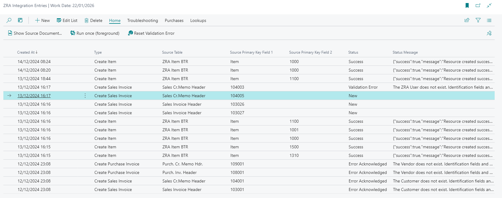
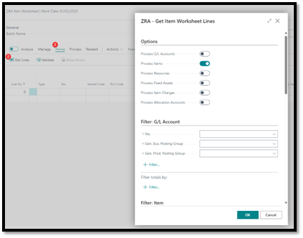
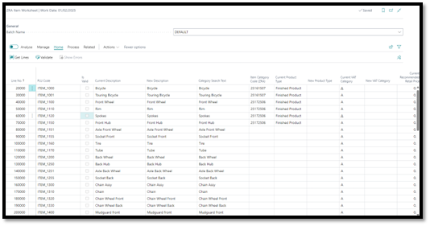
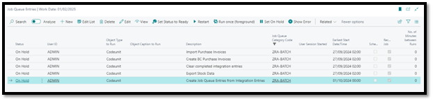
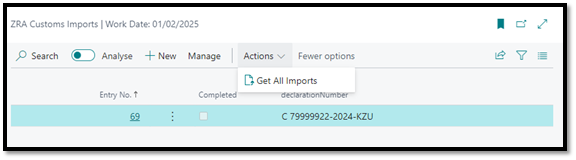
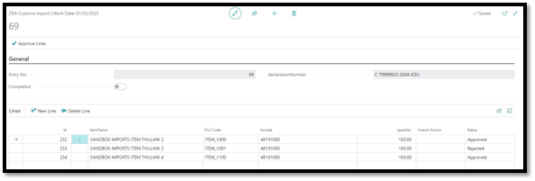

## 3. Integration with ZRA
   The Braintree ZRA Smart Invoice Connector enables you to automate your tax compliance and submission processes with the ZRA system.

   Integration happens in the background and without user interaction. On posting of Sales and Purchase documents, the system creates:
   
   1. Integration Entries. Serves as a log for what has or has not been submitted. 
      1. Also carries status codes and messages for troubleshooting. (See [4. **Troubleshooting**](#4-troubleshooting))
      2. User can resubmit entries for processing from here.
   2. Job Queue Entries. Background process that is responsible for processing the requests.

### 3.1 Invoices & Credit Memos (Sales & Purchases)
ZRA requires certain information on the documents. Checks have been put in place to ensure that they are captured before a document can be released and posted.

>Note: Posted Sales Documents (Invoices and Credit Memos) need to be submitted to the ZRA before they can be printed. The ZRA mandates that certain information is printed on all invoices, but this information is only returned from ZRA after submission. A custom automated job could be configured to print or send invoices by email after reply is received from the ZRA Smart Invoice system.

>If a credit note is for an invoice that has not been fiscalized, the **Apply to Non-Fiscalized Invoice** field on the Credit Memo or Return Order can be set to *Yes*. This will allow the user to post and print non-fiscalized documents.

Requirements:

1. Payment Method Code – Required field on header
2. If Credit Memo or Return Order (only if **Apply to Non-Fiscalized Invoice** = *No*)
   1. Applies-to Doc. Type
   2. Applies-to Doc. No.
3. VAT Posting Setup combination must have a linked ZRA VAT Type
4. ZRA Smart Invoice No. (Purchase only)

Checks during integration:

1. Item must be registered from the ZRA Item Worksheet.
2. **Recommended Retail Price**, if required by the setup on the ZRA VAT Type (this is usually for Tax Code "B")

### 3.2 Item Worksheet
The ZRA Item Worksheet is used to register items with ZRA. It is a required step for document to be submitted.

1. Search for and open the ZRA Item Worksheet.
2. Select a Batch Name to work in.
3. On the ribbon menu, click Home | Get Lines
4. Select the entities you want to pull into the worksheet
5. The filters for each entity will only apply if the entity is selected to be processed.
6. Click OK. The worksheet is now populated with the default information for the entity. If the entity has been registered previously, the user will be able to update the record.

    

    

7. Required fields:
   1. **New Description**
   2. **Item Category Code (ZRA)**
   3. **New Product Type**
   4. **New VAT Category**
   5. **New Recommended Retail Price** (mandatory if required by VAT Type)
   6. **Quantity Unit of Measure Code (ZRA)** – see Integration Setup. This must be a code as defined by the ZRA.
   7. **Packaging Unit of Measure Code (ZRA)** – see Integration Setup. This must be a code as defined by the ZRA.
   8. **Country Code of Origin**

8. Click Home | Register Items. This will process the entries in a background process and the progress can be monitored on the Integration Entries page.

### 3.3 Job Queue
There are 5 Job Queue Entries that are created automatically when the extension is installed. Each of them performs different tasks for the integration to run smoothly.

By default,

1. *Create Job Queue Entries from Integration Entries*: Finds Integration Log Entries with **Status** = *New* and creates a Scheduled Task for them to be processed.
1. *Export Stock Data*: Submits registered ZRA Items (only linked to the Item table) to the Service Provider to satisfy the stock adjustment requirement. (Only applies when using Fiscal Edge as Service Provider)
1. *Clear completed integration entries*: Uses a parameter in the parameter string of the Job Queue Entry to specify the frequency at which it must check for and remove completed records out of the Integration Entries table.
1. *Import Purchase Orders*: If the service provider supports importing of purchase orders from other Smart Invoice customers, this will import the documents into a staging table.
1. *Create BC Purchase Invoices*: If the service provider supports importing of purchase orders from other Smart Invoice customers, this will create purchase documents from the staging tables.

### 3.4 Customs Imports
The ZRA Smart Invoice system allows users to accept or reject goods sitting at customs. This can be done on the Service Provider’s portal, or in Business Central.

1. Search for and open the ZRA Customs Imports page
2. Click Actions | Get All Imports
3. This will fetch any pending imports
4. Open the Customs Import card for an import entry
5. For each line, update the **PLU Code** (a.k.a. ZRA Item No.)
6. Set the **Import Action** to either Approved or Rejected.
7. When all lines are updated, click Approve Lines action on the header.
1. This will submit your selection to the ZRA.

