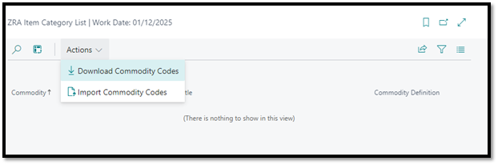
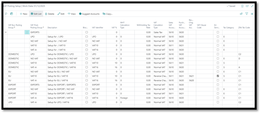
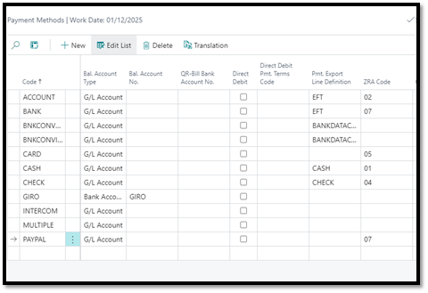
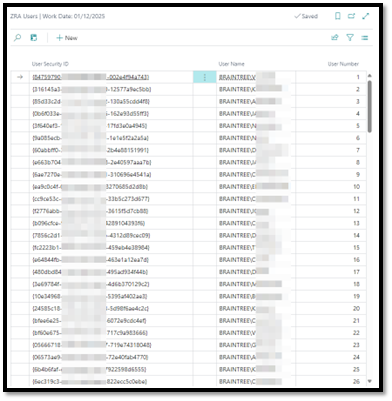
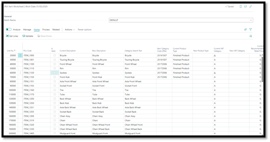
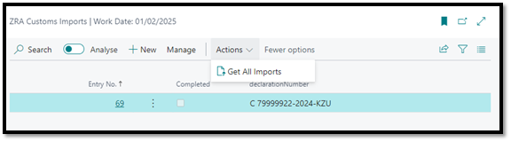
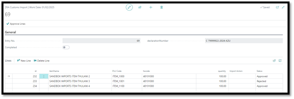

# ZRA SMART INVOICE CONNECTOR USER GUIDE

- [ZRA SMART INVOICE CONNECTOR USER GUIDE](#zra-smart-invoice-connector-user-guide)
  - [1. Introduction](#1-introduction)
  - [2. Setup and Configuration](#2-setup-and-configuration)
    - [2.1 Integration Setup](#21-integration-setup)
    - [2.2 Commodity Codes](#22-commodity-codes)
    - [2.3 ZRA VAT Types](#23-zra-vat-types)
    - [2.4 VAT Product Posting Groups](#24-vat-product-posting-groups)
    - [2.5 VAT Posting Setups](#25-vat-posting-setups)
    - [2.6 Reason Codes](#26-reason-codes)
    - [2.7 Payment Methods](#27-payment-methods)
    - [2.8 User Management](#28-user-management)
  - [3. Integration with ZRA](#3-integration-with-zra)
    - [3.1 Invoices \& Credit Memos (Sales \& Purchases)](#31-invoices--credit-memos-sales--purchases)
    - [3.2 Item Worksheet](#32-item-worksheet)
    - [3.3 Job Queue](#33-job-queue)
    - [3.4 Customs Imports](#34-customs-imports)
  - [4. **Troubleshooting**](#4-troubleshooting)
    - [4.1 Integration Entries](#41-integration-entries)

## 1. Introduction

   The Braintree ZRA Smart Invoice Connector is a software solution designed to integrate with the Zambia Revenue Authority (ZRA) system, enabling businesses to automate their tax compliance and submission processes. This user guide provides an overview of the system's features and functionality, as well as step-by-step instructions on how to use the system.

## 2. Setup and Configuration

   Before using the Braintree ZRA Smart Invoice Connector, you need to set up and configure the system. This involves:

- Installing the extension in your Business Central environment
- Configuring the system settings, such as the ZRA tax code and integration setup
- Setting up user accounts and permissions

>The following system settings need to be configured.

### 2.1 Integration Setup

1. Open the ZRA Integration Setup menu.
2. Select the **Integration Service Provider**
3. Confirm that the **Target API URL** is correct for the Service Provider
4. Enter the following fields 
    1. **API Key**
    2. **SDC ID**
5. Lastly, **Enable** the integration
6. If you want to host the list of commodity codes locally in the database, you can leave the **Use Web Service for commodity lookup** field disabled. Not all service providers do, but if the chosen Service Provider does support commodity code lookup, you can enable this feature.

>The user can download a copy of ZRA Codes used for mapping in the system as described in this document.

### 2.2 Commodity Codes
If service providers do not provide an API endpoint for the commodities, download and import the commodities list from the ZRA Item Category List.

### 2.3 ZRA VAT Types
A predefined list is created when the extension is installed. This list can be modified as required. 

Description of fields:

- **Code**: Unique identifier, used by most Service Providers
- **Value**: A secondary identifier, used by some Service Providers.
- **Blocked**: *Not used yet, reserved for future use.* 
- **Requires recommended Retail Price**: When enabled, requires items to be registered with a recommended retail price when this code is used on a transaction.

### 2.4 VAT Product Posting Groups
Link Zambian Tax Codes to VAT Product Posting Groups. This is the code used for Items when registering them with ZRA.

### 2.5 VAT Posting Setups
Link Zambian Tax Codes to VAT Posting Setup. These are the Tax codes used on document lines when the document is submitted to ZRA.

### 2.6 Reason Codes
Link the predefined service provider reason codes to the Reason Codes in Business Central.

### 2.7 Payment Methods
Link supplier defined codes to the existing Payment Methods in Business Central.

### 2.8 User Management 
Two Permission Sets have been added:

1. ZRA ALL BTR – For administrators of the integration, that are allowed to change the configuration.
2. ZRA BASIC BTR – For all other users, so that the integration can happen in the background.

>The system also maintains a list of users and assigns a unique integer to each user as required by the ZRA interface. This should not require any maintenance by an administrator.

## 3. Integration with ZRA
   The Braintree ZRA Smart Invoice Connector enables you to automate your tax compliance and submission processes with the ZRA system.

   Integration happens in the background and without user interaction. On posting of Sales and Purchase documents, the system creates:
   
   1. Integration Entries. Serves as a log for what has or has not been submitted. 
      1. Also carries status codes and messages for troubleshooting. (See [4. **Troubleshooting**](#4-troubleshooting))
      2. User can resubmit entries for processing from here.
   2. Job Queue Entries. Background process that is responsible for processing the requests.

### 3.1 Invoices & Credit Memos (Sales & Purchases)
ZRA requires certain information on the documents. Checks have been put in place to ensure that they are captured before a document can be released and posted.

>Note: Posted Sales Documents (Invoices and Credit Memos) need to be submitted to the ZRA before they can be printed. The ZRA mandates that certain information is printed on all invoices, but this information is only returned from ZRA after submission. A custom automated job could be configured to print or send invoices by email after reply is received from the ZRA Smart Invoice system.

>If a credit note is for an invoice that has not been fiscalized, the **Apply to Non-Fiscalized Invoice** field on the Credit Memo or Return Order can be set to *Yes*. This will allow the user to post and print non-fiscalized documents.

Requirements:

1. Payment Method Code – Required field on header
2. If Credit Memo or Return Order (only if **Apply to Non-Fiscalized Invoice** = *No*)
   1. Applies-to Doc. Type
   2. Applies-to Doc. No.
3. VAT Posting Setup combination must have a linked ZRA VAT Type
4. ZRA Smart Invoice No. (Purchase only)

Checks during integration:

1. Item must be registered from the ZRA Item Worksheet.
2. **Recommended Retail Price**, if required by the setup on the ZRA VAT Type (this is usually for Tax Code "B")

### 3.2 Item Worksheet
The ZRA Item Worksheet is used to register items with ZRA. It is a required step for document to be submitted.

1. Search for and open the ZRA Item Worksheet.
2. Select a Batch Name to work in.
3. On the ribbon menu, click Home | Get Lines
4. Select the entities you want to pull into the worksheet
5. The filters for each entity will only apply if the entity is selected to be processed.
6. Click OK. The worksheet is now populated with the default information for the entity. If the entity has been registered previously, the user will be able to update the record.

    

    

7. Required fields:
   1. **New Description**
   2. **Item Category Code (ZRA)**
   3. **New Product Type**
   4. **New VAT Category**
   5. **New Recommended Retail Price** (mandatory if required by VAT Type)
   6. **Quantity Unit of Measure Code (ZRA)** – see Integration Setup. This must be a code as defined by the ZRA.
   7. **Packaging Unit of Measure Code (ZRA)** – see Integration Setup. This must be a code as defined by the ZRA.
   8. **Country Code of Origin**

8. Click Home | Register Items. This will process the entries in a background process and the progress can be monitored on the Integration Entries page.

### 3.3 Job Queue
There are 5 Job Queue Entries that are created automatically when the extension is installed. Each of them performs different tasks for the integration to run smoothly.

By default,

1. *Create Job Queue Entries from Integration Entries*: Finds Integration Log Entries with **Status** = *New* and creates a Scheduled Task for them to be processed.
1. *Export Stock Data*: Submits registered ZRA Items (only linked to the Item table) to the Service Provider to satisfy the stock adjustment requirement. (Only applies when using Fiscal Edge as Service Provider)
1. *Clear completed integration entries*: Uses a parameter in the parameter string of the Job Queue Entry to specify the frequency at which it must check for and remove completed records out of the Integration Entries table.
1. *Import Purchase Orders*: If the service provider supports importing of purchase orders from other Smart Invoice customers, this will import the documents into a staging table.
1. *Create BC Purchase Invoices*: If the service provider supports importing of purchase orders from other Smart Invoice customers, this will create purchase documents from the staging tables.

### 3.4 Customs Imports
The ZRA Smart Invoice system allows users to accept or reject goods sitting at customs. This can be done on the Service Provider’s portal, or in Business Central.

1. Search for and open the ZRA Customs Imports page
2. Click Actions | Get All Imports
3. This will fetch any pending imports
4. Open the Customs Import card for an import entry
5. For each line, update the **PLU Code** (a.k.a. ZRA Item No.)
6. Set the **Import Action** to either Approved or Rejected.
7. When all lines are updated, click Approve Lines action on the header.
1. This will submit your selection to the ZRA.

## 4. **Troubleshooting**
   If you encounter any issues or errors while using the Braintree ZRA Smart Invoice Connector, refer to the troubleshooting guide below:

### 4.1 Integration Entries

- Check the Integration Entry or Job Queue Entries for error messages
- Verify that the system settings are correct
- Use the guide below to confirm what each status means and what actions can be taken.
- The different states that an entry can be in, are:
  - *New*: Newly created entry. The "Create Job Queue Entries from Integration Entries" Job Queue Entry, will pick-up these entries and schedule them for processing.
  - *Validation Error*: An entry that fails its validation checks. No Job Queue Entry has been created.
  - *Job Queue Created*: Job Queue Entry has been created and scheduled to run.
  - *Error*: An error occurred when executing the Job Queue Entry.
  - *Error Acknowledged*: An Error or Validation Error occurred, but it is an error that cannot be resolved with the integration, or the entry was created in error. Can only manually be set to this value.
  - *Success*: Job Queue Entry executed successfully.
- Actions on the Integration Entries page:
  - Home
    - *Show Source Document*: For document type entries, navigates to the source record for this entry.
    - *Run once (foreground)*: If a Job Queue Entry exists, runs it immediately.
    - *Reset Validation Error*: For selected records, where the **Status** = *Validation Error*, sets the **Status** to *New*, and clears the **Status Message**. This will allow the "Create Job Queue Entries from Integration Entries" Job Queue Entry to pick them up and schedule them for sending.
  - Troubleshooting
    - *Show Status Message*: Displays the detail of the **Status Message **in a pop-up dialog.
    - *View Request Body*: If a Job Queue Entry exists, displays the content of the that has been parsed to be sent for processing.
    - *Recreate Integation Entry*: 
      - For all **Status**, except *Success*, it sets the **Status** = *New*, clears **Status Message** and attempts to create the Job Queue Entry. May result in Status being set to Validation Error if there are issues processing the data.
      - If the **Status** = *Success*, it creates a copy of the entry, sets the **Status** = *New*, clears **Status Message** and attempts to create the Job Queue Entry. May result in Status being set to Validation Error if there are issues processing the data.
    - *Acknowledge Error*: Sets the **Status** to "*Error Acknowledged*". This will let the entry be cleaned up by the "Clear completed integration entries" job.
 
- If you are unable to resolve the issue, please feel free to contact the Braintree support team for assistance. 

Email: <bcsupport@braintree.co.za>

